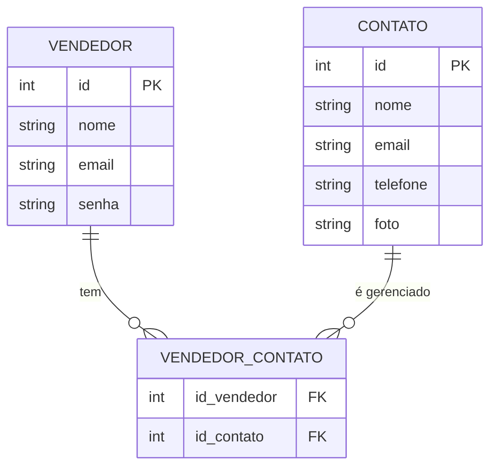

# Painel de Controle de um Vendedor

## Modelagem do Banco de Dados

O banco de dados é composto por duas entidades principais: **Vendedor** e **Contato**.  
Estas entidades possuem um relacionamento **muitos-para-muitos**, que é representado por uma tabela intermediária chamada **VENDEDOR_CONTATO**.

Utilizamos a notação **Crow’s Foot** para representar os relacionamentos, que é uma forma padrão de modelagem de bancos de dados relacionais.

