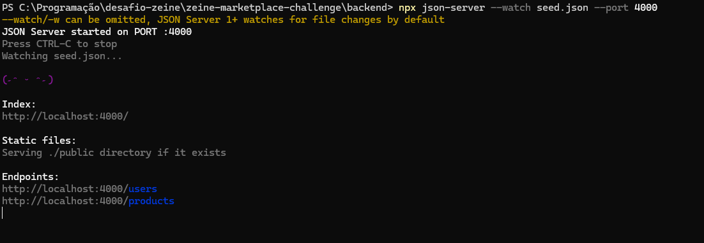

# 🛍️ Marketplace - Painel do Vendedor | Desafio Zeine

Olá, equipe Zeine! 👋

Este projeto é a minha solução para o desafio técnico de Desenvolvedor Full Stack. Foquei em construir um MVP robusto, pragmático e alinhado com a cultura da empresa, demonstrando minha capacidade de transformar ideias em realidade.

Grande parte do trabalho, mesmo que não visível na interface, está detalhado no código.

---

## 🚀 Jornada do Projeto & Decisões Técnicas

O projeto foi uma verdadeira corrida contra o tempo. Enfrentei desafios importantes, principalmente para configurar o ambiente de build e resolver erros de ESLint e tipagem em TypeScript. Apesar de trabalhoso, esse processo foi essencial para garantir uma base sólida.

Diante do prazo apertado, tomei uma decisão estratégica: utilizei o **json-server** como backend mock. Assim, consegui avançar rapidamente na lógica do frontend (listagem e cadastro de produtos) e na integração com a API. Essa abordagem permitiu focar no que realmente importa: experiência do usuário e funcionalidades principais.

O deploy na Vercel também trouxe desafios. Como a aplicação está em uma estrutura de monorepo (frontend e backend separados), a Vercel não detectou as configurações automaticamente. Foi necessário configurar manualmente o Root Directory e ajustar o `vercel.json` para que o build fosse concluído com sucesso.

Todos esses detalhes estão registrados no repositório, tanto na documentação quanto nos commits semânticos e pull requests.

---

## ✅ O que foi entregue

- **Três telas funcionais:** Login, Dashboard, Produtos
- **Autenticação simples:** Redirecionamento para login ao tentar acessar a tela de produtos sem permissão
- **Listagem de produtos:** Com filtro funcional
- **Cadastro e edição de produtos:** Incluindo upload de imagem simulado
- **Easter Egg:** A mensagem “Tá esperando o quê? Boraa moeer!! 🚀” aparece após 7 segundos de hover no botão “Novo Produto”

---

## 🛠️ Tech Stack & Arquitetura

- **Frontend:** Next.js 14 (App Router), TypeScript, Tailwind CSS, React Query, React Hook Form
- **Backend:** FastAPI (Python), SQLAlchemy, PostgreSQL (para a arquitetura ideal), Pydantic
- **DevOps:** Docker, Vercel (frontend)

A estrutura de pastas foi pensada para ser escalável, separando claramente as responsabilidades de API, componentes e lógica de negócio. A arquitetura completa está disponível no repositório.

---

## ▶️ Como rodar o projeto

A maneira mais fácil de validar o projeto é usando Docker:

1. **Clone o repositório:**

```bash
git clone <repository-url>
cd zeine-marketplace-challenge
```

2. **Inicie os serviços:**

```bash
docker-compose up -d
```

3. **Acesse a aplicação:**

- Frontend: [http://localhost:3000](http://localhost:3000)
- Backend (mock): [http://localhost:4000](http://localhost:4000)

### 💡 Alternativa sem Docker (Next.js + JSON-Server)

Caso o Docker apresente problemas, é possível rodar o projeto manualmente:

1. **Inicie o backend mock:**

```bash
cd backend
npx json-server --watch seed.json --port 4000
```

2. **Em outro terminal, inicie o frontend:**

```bash
cd frontend
npm install
npm run dev
```

---

## 🌐 Links para demonstração

- **Deploy:** [https://zeine-marketplace-challenge-marciob-psi.vercel.app/login](https://zeine-marketplace-challenge-marciob-psi.vercel.app/login)
- **Vídeo de demonstração:** [Loom](https://www.loom.com/share/5bab7986f9634c3d9c9ffed0d8dee246?sid=b148dcb7-6a2b-4784-aed9-f5b55b0247c9)
- **Credenciais de teste:** `demo@example.com` / `Demo123!`

---

## 🖼️ Screenshots





---

## ⚠️ Observação importante sobre o deploy

A URL do deploy está correta, mas a funcionalidade de login não está ativa, pois a aplicação no Vercel está configurada para se conectar a um servidor local (`http://localhost:4000`), que não é acessível publicamente.

Para validar todas as funcionalidades, rode o projeto localmente com Docker (ou no terminal, conforme mostrado no vídeo e aqui no readme) e utilize as credenciais de teste. O vídeo de demonstração também apresenta todas as funcionalidades implementadas.

---

## ⏰ Nota Final sobre o Prazo

Na reta final, enfrentei o clássico dilema entre o prazo e a qualidade da apresentação. Optei por estender a entrega em algumas horas para garantir que o vídeo de demonstração fosse claro, completo e refletisse o meu melhor trabalho. Acredito que a qualidade da documentação visual justifica essa decisão junto ao desafiante deploy na plataforma vercel.

Agradeço pela oportunidade e confiança! Espero que este projeto evidencie minha paixão por tecnologia, atenção aos detalhes e compromisso em entregar soluções estratégicas e de alto nível. 🚀✨

**Boraa moeer!! 🔥🚀**
