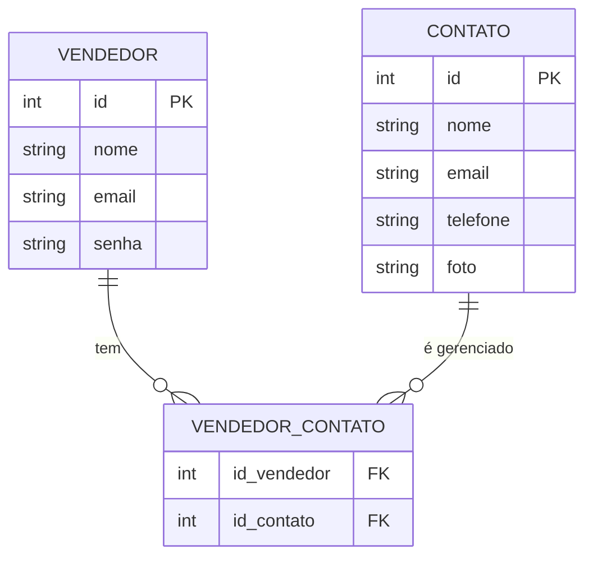

# Painel de Controle de Vendedor

Este projeto é um **Painel de Controle para Vendedores**, permitindo que vendedores se cadastrem, façam login e gerenciem seus contatos.

---

## 🔹 Modelagem do Banco de Dados

O banco de dados possui três tabelas principais:

- **VENDEDOR**: armazena os dados do vendedor.
- **CONTATO**: armazena os contatos gerenciados pelo vendedor.
- **VENDEDOR_CONTATO**: tabela intermediária que representa o relacionamento muitos-para-muitos entre vendedores e contatos.

### Diagrama ER (Crow’s Foot)



## 🔹 Endpoints da API

### 1. Login

O **vendedor** pode fazer login utilizando email e senha.

```python
@app.post("/login")
def login_vendedor(vendedor: VendedorLogin)
```

### 2. Cadastro

O vendedor pode se cadastrar utilizando **nome**, **email** e **senha**.

```python
@app.post("/cadastro")
def cadastrar_vendedor(vendedor: VendedorLogin):
```
