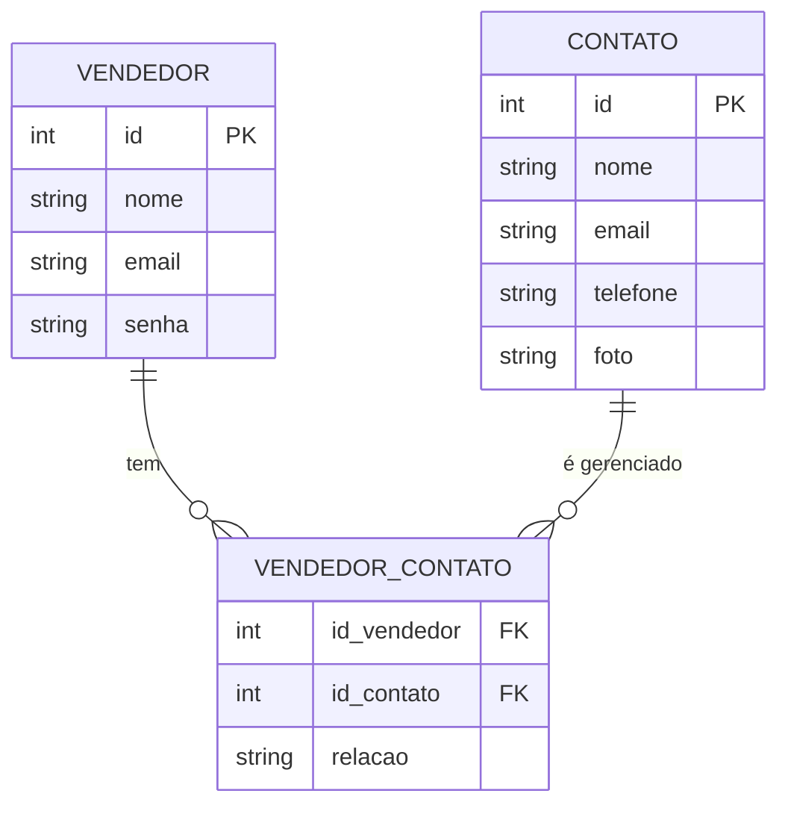

# 📑 Sumário

- [Painel de Controle de Vendedor](#painel-de-controle-de-vendedor)
- [Modelagem do Banco de Dados](#modelagem-do-banco-de-dados)
  - [Diagrama ER (Crow’s Foot)](#diagrama-er-crows-foot)
- [Documentação - Caso de Uso](#documentação---caso-de-uso)
  - [1. Login do Vendedor](#1-login-do-vendedor)
  - [2. Cadastro do Vendedor](#2-cadastro-do-vendedor)
  - [3. Cadastrar Contato](#3-cadastrar-contato)
  - [4. Editar Contato](#4-editar-contato)
  - [5. Listar Contatos do Vendedor](#5-listar-contatos-do-vendedor)
  - [6. Visualizar Informações do Contato](#6-visualizar-informações-do-contato)
- [Tecnologias utilizadas](#tecnologias-utilizadas)
  - [React + Vite](#react--vite)
  - [FastAPI](#fastapi)
  - [Postgres](#postgres)
  - [Cloudinary](#cloudinary)
  - [Deploys](#deploys)
- [Endpoints da API](#endpoints-da-api)
  - [1. Login](#1-login)
  - [2. Cadastro](#2-cadastro)
  - [3. Cadastar contato](#3-cadastar-contato)
  - [4. Editar contato](#4-editar-contato)
  - [5. Listar Contatos do Vendedor](#5-listar-contatos-do-vendedor)
- [Rodando imagem com Docker](#rodando-imagem-com-docker)
- [Links de deploy](#links-de-deploy)

---

# Painel de Controle de Vendedor

Este projeto é um **Painel de Controle para Vendedores**, permitindo que vendedores se cadastrem, façam login e gerenciem seus contatos.

---

# Modelagem do Banco de Dados

O banco de dados possui três tabelas principais:

- **VENDEDOR**: armazena os dados do vendedor.
- **CONTATO**: armazena os contatos gerenciados pelo vendedor.
- **VENDEDOR_CONTATO**: tabela intermediária que representa o relacionamento muitos-para-muitos entre vendedores e contatos.

### Diagrama ER (Crow’s Foot)



## Documentação - Caso de Uso


### 1. Login do Vendedor

**Ator:** Vendedor  
**Objetivo:** Permitir que o vendedor acesse o sistema  
**Pré-condições:** O vendedor deve estar cadastrado com email e senha

**Fluxo Principal:**

1. Vendedor envia email e senha para `/login`.
2. Sistema valida credenciais.
3. Sistema retorna token de autenticação.

**Fluxos Alternativos:**

- **Email ou senha incorretos:**  
  2a. Sistema detecta erro nas credenciais.  
  2b. Sistema retorna mensagem de erro ao vendedor.

**Pós-condições:** Vendedor autenticado e apto a acessar funcionalidades restritas

---

### 2. Cadastro do Vendedor

**Ator:** Vendedor  
**Objetivo:** Criar uma nova conta de vendedor  
**Pré-condições:** O vendedor não deve estar cadastrado com o email informado

**Fluxo Principal:**

1. Vendedor envia **nome**, **email** e **senha** para `/cadastro`.
2. Sistema verifica se email está em uso.
3. Sistema cria a conta.

**Fluxos Alternativos:**

- **Email já em uso:**  
  2a. Sistema detecta email duplicado.  
  2b. Sistema retorna mensagem informando que o email já está cadastrado.

- **Senha inválida (muito curta ou sem caracteres especiais):**  
  2a. Sistema valida senha.  
  2b. Sistema retorna mensagem de erro solicitando senha válida.

**Pós-condições:** Vendedor cadastrado e apto a fazer login

## 3. Cadastrar Contato

**Ator:** Vendedor  
**Objetivo:** Adicionar um novo contato à sua lista  
**Pré-condições:** Vendedor autenticado

**Fluxo Principal:**

1. Vendedor envia **nome**, **email**, **telefone**, **foto** e **relacao** para `/cadastrarContato`.
2. Sistema valida dados.
3. Sistema cria o contato vinculado ao vendedor.

**Fluxos Alternativos:**

- **Dados incompletos ou inválidos:**  
  2a. Sistema detecta inconsistência nos dados.  
  2b. Sistema retorna mensagem de erro solicitando correção.

**Pós-condições:** Contato armazenado e vinculado ao vendedor

---

### 4. Editar Contato

**Ator:** Vendedor  
**Objetivo:** Atualizar informações de um contato existente  
**Pré-condições:** Vendedor autenticado e contato existente

**Fluxo Principal:**

1. Vendedor envia dados atualizados (**nome**, **email**, **telefone**, **foto**, **relacao**) para `/editarContato/{vendedor_id}/{contato_id}`.
2. Sistema valida informações.
3. Sistema atualiza o contato.

**Fluxos Alternativos:**

- **Contato não encontrado:**  
  2a. Sistema verifica se contato existe.  
  2b. Sistema retorna mensagem de erro informando que o contato não foi encontrado.

- **Dados inválidos:**  
  2a. Sistema detecta erro nos dados enviados.  
  2b. Sistema retorna mensagem solicitando correção.

**Pós-condições:** Contato atualizado com novas informações

---

### 5. Listar Contatos do Vendedor

**Ator:** Vendedor  
**Objetivo:** Visualizar todos os contatos cadastrados  
**Pré-condições:** Vendedor autenticado

**Fluxo Principal:**

1. Vendedor solicita a lista de contatos via `/vendedor/{vendedor_id}/contatos`.
2. Sistema retorna todos os contatos do vendedor.

**Fluxos Alternativos:**

- **Nenhum contato cadastrado:**  
  2a. Sistema detecta lista vazia.  
  2b. Sistema retorna mensagem informando que não há contatos cadastrados.

**Pós-condições:** Vendedor visualiza a lista completa de contatos

---

### 6. Visualizar Informações do Contato

**Ator:** Vendedor  
**Objetivo:** Visualizar informações detalhadas do contato  
**Pré-condições:** Vendedor autenticado

**Fluxo Principal:**

1. Vendedor solicita informações do contato.
2. Sistema solicita a senha do vendedor.
3. Vendedor informa a senha.
4. Sistema disponibiliza informações do contato na UI.

**Fluxos Alternativos:**

- **Senha incorreta:**  
  3a. Sistema detecta senha incorreta.  
  3b. Sistema retorna mensagem de erro solicitando nova tentativa.

- **Contato não encontrado:**  
  1a. Sistema verifica existência do contato.  
  1b. Sistema retorna mensagem informando que o contato não existe.

**Pós-condições:** Vendedor visualiza as informações do contato com segurança

## Tecnologias utilizadas

### React + Vite

No front-end, optei por utilizar React junto com Vite para desenvolver uma solução rápida e eficiente, aproveitando meu conhecimento prévio nessas tecnologias. Para estilização, utilizei **Tailwind CSS**, permitindo criar estilos de forma mais dinâmica, responsiva e consistente.

### FastAPI

No back-end, utilizei **FastAPI** devido à sua simplicidade e eficiência na manipulação de bancos de dados, tornando mais ágil a execução de queries e o gerenciamento das rotas da API.

### Postgres

Escolhi **PostgreSQL** por ser um banco de dados relacional robusto, que facilita consultas complexas envolvendo múltiplas tabelas. Para otimizar o armazenamento, utilizei Cloudinary para hospedar imagens, evitando que arquivos binários poluam o banco e retornando apenas os links das imagens no servidor.

### Cloudinary

Durante o desenvolvimento, utilizei minha **API key** do Cloudinary para testes locais. É importante destacar que, embora isso seja conveniente para desenvolvimento, não é uma boa prática em produção. No deploy, todas as variáveis sensíveis foram corretamente armazenadas em locais seguros.

### Deploys

O projeto foi deployado no **Render** e na **Vercel**, plataformas gratuitas e de fácil utilização, garantindo que a aplicação esteja disponível online de forma prática e confiável.

## Endpoints da API

A api, localmente, rodará na porta **8000**. Para visualizar as requisições visualmente, utilizar **localhost/8000/docs**.

### 1. Login

O **vendedor** pode fazer login utilizando email e senha.

```python
@vendedor.post("/login")
def login_vendedor(vendedor: VendedorLogin)
```

### 2. Cadastro

O vendedor pode se cadastrar utilizando **nome**, **email** e **senha**.

```python
@vendedor.post("/cadastro")
def cadastrar_vendedor(vendedor: VendedorLogin):
```

### 3. Cadastar contato

Permite que um **vendedor** cadastre um novo contato com nome, email, telefone e foto.

```python
@contato.post("/cadastrarContato")
def cadastrar_contatos(
    vendedor_id: int,
    nome: str = Form(...),
    email: str = Form(...),
    telefone: str = Form(...),
    relacao: str = Form(...),
    foto: UploadFile = File(...)
)
```

### 4. Editar contato

Permite atualizar os dados de um contato existente, incluindo nome, email, telefone e foto.

```python
@contato.put("/editarContato/{vendedor_id}/{contato_id}")
def editar_contato(
    vendedor_id: int = Path(...),
    contato_id: int = Path(...),
    nome: str = Form(None),
    email: str = Form(None),
    telefone: str = Form(None),
    relacao: str = Form(None),
    foto: UploadFile = File(None)
)
```

### 5. Listar Contatos do Vendedor

Retorna todos os contatos associados a um vendedor específico.

```python
@contato.get("/vendedor/{vendedor_id}/contatos")
def listar_contatos_vendedor(vendedor_id: int = Path(...))
```

## Rodando imagem com Docker

### 1. Clone o repositório

```bash
git clone https://github.com/andersonstack/developer-challenge.git
cd developer-challenge
```

### 2. Crie os arquivos .env a partir dos exemplos

```bash
cp backend/.env.example backend/.env
cp frontend/.env.example frontend/.env
```

### 3. Suba os containers com Docker Compose

```bash
docker compose up --build -d
```

|                    | Tecnologia | Nome Container | Porta |
| ------------------ | ---------- | -------------- | ----- |
| **Banco de dados** | Postgres   | db             | 5432  |
| **Backend**        | FastAPI    | backend        | 8000  |
| **Frontend**       | React      | frontend       | 3000  |

- **Backend** vai rodar no _localhost:8000_
- **Frontend** vai rodar no _localhost:3000_

## Links de deploy

- **Backend**: https://developer-challenge-backend.onrender.com/docs </br>

- **Frontend**: https://developer-challenge-omega.vercel.app/
