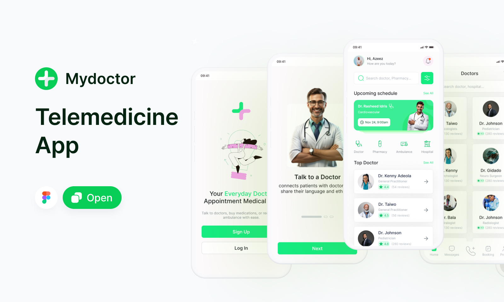

# Desafio Técnico | Guard - Gerenciador de Contatos 💂‍♂️

## 🎯 Objetivo

Desenvolver 3 telas de um sistema web para **gestão de contatos em um marketplace**, baseado no design fornecido via Figma.

O sistema simula o **painel de controle de um vendedor**, onde é possível cadastrar, visualizar e gerenciar seus contatos.

- **Protótipo Figma**:
  [https://www.figma.com/community/file/1426246785677931248](https://www.figma.com/community/file/1426246785677931248)

- **Prazo de entrega**:
  4 dias a partir do recebimento.

---

## 📌 Requisitos

### Funcionalidades obrigatórias

As seguintes telas e recursos devem ser implementados:

1. **Tela de Login**

   - Autenticação com e-mail e senha.
   - Validação de campos.

2. **Tela de Listagem de Contatos**

   - Exibe todos os contatos cadastrados.
   - Permite filtro por letra inicial do nome.
   - Contatos exibidos com foto, nome, telefone e e-mail.

3. **Tela de Cadastro de Contato**

   - Upload de foto do contato.
   - Campos para nome, telefone, e-mail.
   - Botões para **Salvar** ou **Cancelar**.

4. **Backend Funcional**

   - Deve suportar o armazenamento de usuários, autenticação, contatos e seus atributos.

5. **Banco de dados**

   - PostgreSQL ou MongoDB (ou outro de sua escolha, se bem justificado).

6. **Mensagem secreta**

   - Ao manter o mouse sobre o botão “Adicionar contato” por 7 segundos, surge um tooltip especial:
     `“Tá esperando o quê? Boraa moeer!! 🚀”`

---

### Diferenciais (opcionais, mas recomendados)

1. **Deploy**

   - Publique o front-end (ex: Vercel) e o back-end (ex: Render) se possível.
   - Inclua os links no README.

2. **Documentação**

   - Explique a estrutura do projeto, como executar, e decisões técnicas.

3. **Testes automatizados**

   - Testes simples de integração (API) e/ou de componentes (UI).

4. **Diagrama ERD**

   - Um pequeno diagrama mostrando entidades e relações (usuários, contatos, atributos).

---

## 🛠️ Stacks recomendadas

Você pode usar qualquer tecnologia, mas sugerimos:

- **Frontend**: Next.js ou React (web)
- **Backend**: FastAPI ou NestJS
- **Banco de dados**: PostgreSQL ou MongoDB

---

## 📦 Entregáveis

1. **Repositório com o código-fonte**

   - GitHub, GitLab ou Bitbucket.

2. **Instruções de execução**

   - Como rodar o frontend e backend localmente.
   - Se possível, um script ou Docker.

3. **Demonstração visual**

   - Imagens ou vídeo da aplicação em funcionamento.

4. **(Opcional) Link do Deploy**

   - Front e/ou back publicado.

---

## 🔍 O que será avaliado

- Organização e clareza do código
- Estrutura do projeto
- Boas práticas de autenticação e manipulação de dados
- UX simples e funcional
- Atenção aos detalhes (como a mensagem secreta 👀)

---

## 📩 Dúvidas?

Se tiver qualquer dúvida durante o desafio, envie uma mensagem. Estamos aqui para ajudar. Boa sorte e...
**Boraa moeer!! 🔥🚀**
