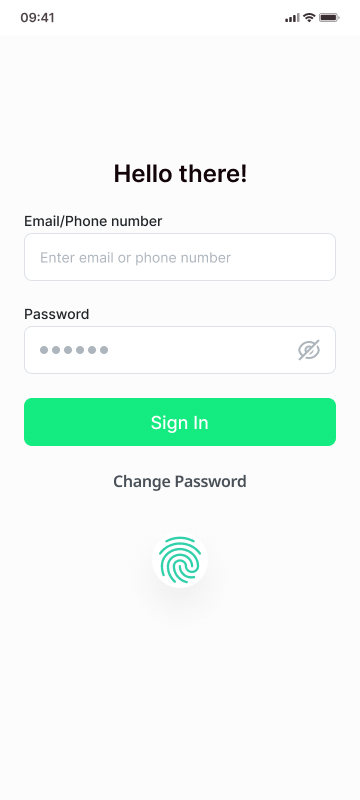
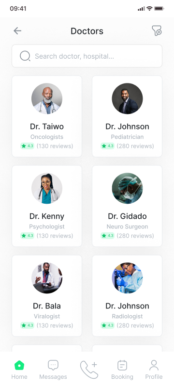
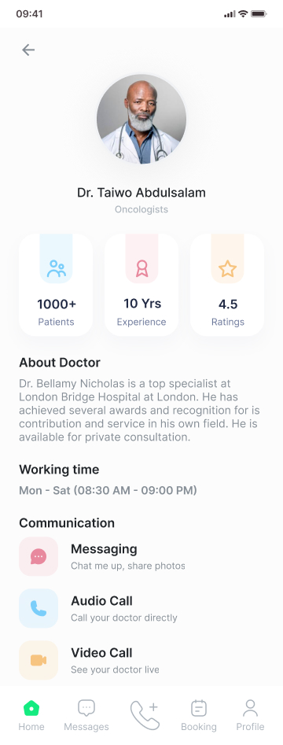

# Desafio Prático para Desenvolvedor | Telemedicina

## Objetivo

Desenvolver 3 telas de um App de telemedicina, com base no protótipo e design fornecidos. O software deve incluir integração com um backend para armazenamento de informações, autenticação de usuários e acesso a dados dos médicos.

- **Protótipo**: Design do Figma, projeto da comunidade: [Link](https://www.figma.com/community/file/1337949757381065808)

- **Prazo**: 5 dias, é o prazo para conclusão do desafio. Contados a partir da notificação do candidato.

- **Stacks Obrigatórias**:

  - _Nenhuma_: O candidato pode escolher as tecnologias que deseja utilizar.

- **Stacks Recomendadas (não obrigatórias)**:
  - _Front-end_: React-Native ou Next.js
  - _Back-end_: FastAPI ou Nest.js
  - _Banco de dados_: PostgreSQL ou MongoDB

---

## Requisitos

**Essenciais**

1. **Funcionalidades do software**: As seguintes telas e funcionalidades são essenciais:

   - **Login**: Tela de autenticação de usuários, permitindo sign-in.
   - **Home**: Tela de _HOME_ com informações gerais e navegação para as outras telas.
   - **About Doctor**: Tela com detalhes sobre os médicos, incluindo informações de perfil e especialidades.
   - **Outras telas**: Adicione uma mensagem secreta: “Boraa moeer!!”

  

2. **Implantação do Banco de Dados**: Configure e implante o banco de dados escolhido.
3. **Desenvolvimento do Back-end**: Implemente os endpoints necessários para gerenciar dados de usuários e médicos, utilizando FastAPI ou Nest.js.
4. **Desenvolvimento do Front-end**: Crie uma interface responsiva para dispositivos móveis, com as telas de Login, Home e About Doctor.
5. **Autenticação**: Implemente a funcionalidade de autenticação de usuários, seguindo as melhores práticas de segurança.

**Diferenciais**

1. **Estrutura ERD**: Desenvolva um diagrama de entidade-relacionamento (ERD) para modelar os dados do software.
2. **Testes Automatizados**: Crie testes automatizados para o back-end e front-end.
3. **Documentação Abrangente**: Forneça documentação clara e detalhada explicando a estrutura do banco de dados, a implementação dos endpoints do back-end, a autenticação e qualquer outra parte relevante do código.

---

## Entregáveis

1. **Código-fonte**: Hospede o código-fonte do software em um repositório Git (GitHub, GitLab, etc.).
2. **Instruções de Execução**: Inclua instruções claras sobre como configurar e executar o software.
3. **Demonstração Visual**: Adicione fotos ou vídeos do software em execução para demonstração.

---

## Observações

- Este desafio tem o objetivo de avaliar suas habilidades técnicas, sua capacidade de desenvolver uma aplicação completa e sua compreensão de conceitos modernos de desenvolvimento.
- A ênfase principal será na qualidade da entrega, incluindo a clareza do código, a organização do projeto, a eficiência das soluções implementadas.
- Caso encontre algum problema ou tenha dúvidas durante o desenvolvimento, sinta-se à vontade para entrar em contato conosco para esclarecimentos adicionais.

---

Boa sorte e estamos ansiosos para ver o que você vai criar! ☀🚀
