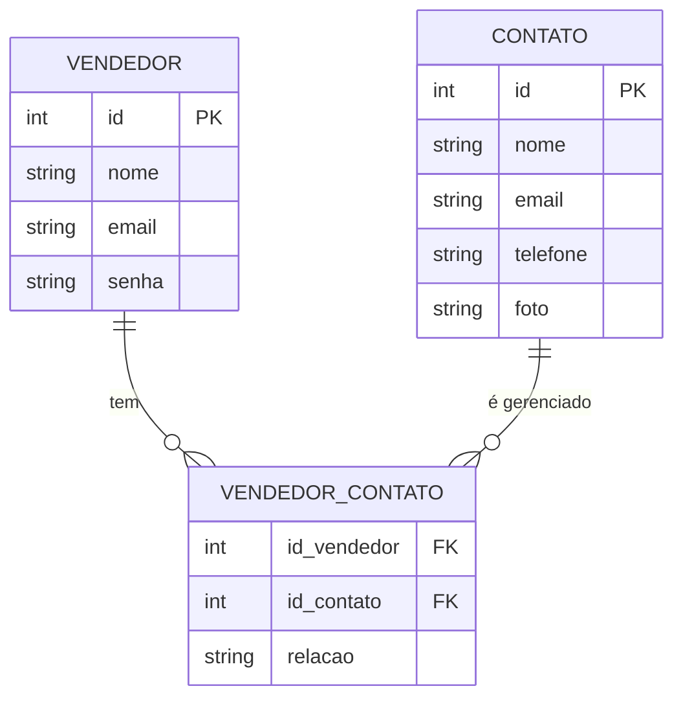

# Painel de Controle de Vendedor

Este projeto é um **Painel de Controle para Vendedores**, permitindo que vendedores se cadastrem, façam login e gerenciem seus contatos.

---

## 🔹 Modelagem do Banco de Dados

O banco de dados possui três tabelas principais:

- **VENDEDOR**: armazena os dados do vendedor.
- **CONTATO**: armazena os contatos gerenciados pelo vendedor.
- **VENDEDOR_CONTATO**: tabela intermediária que representa o relacionamento muitos-para-muitos entre vendedores e contatos.

### Diagrama ER (Crow’s Foot)



## 🔹 Endpoints da API

A api, localmente, rodará na porta **8000**. Para visualizar as requisições visualmente, utilizar **localhost/8000/docs**.

### 1. Login

O **vendedor** pode fazer login utilizando email e senha.

```python
@app.post("/login")
def login_vendedor(vendedor: VendedorLogin)
```

### 2. Cadastro

O vendedor pode se cadastrar utilizando **nome**, **email** e **senha**.

```python
@app.post("/cadastro")
def cadastrar_vendedor(vendedor: VendedorLogin):
```

### 3. Cadastar contato

Permite que um **vendedor** cadastre um novo contato com nome, email, telefone e foto.

```python
@app.post("/cadastrarContato")
def cadastrar_contatos(
    vendedor_id: int,
    nome: str = Form(...),
    email: str = Form(...),
    telefone: str = Form(...),
    foto: UploadFile = File(...)
)
```

### 4. Editar contato

Permite atualizar os dados de um contato existente, incluindo nome, email, telefone e foto.

```python
@app.put("/editarContato/{vendedor_id}/{contato_id}")
def editar_contato(
    vendedor_id: int = Path(...),
    contato_id: int = Path(...),
    nome: str = Form(None),
    email: str = Form(None),
    telefone: str = Form(None),
    foto: UploadFile = File(None)
)
```

### 5. Listar Contatos do Vendedor

Retorna todos os contatos associados a um vendedor específico.

```python
@app.get("/vendedor/{vendedor_id}/contatos")
def listar_contatos_vendedor(vendedor_id: int = Path(...))
```
